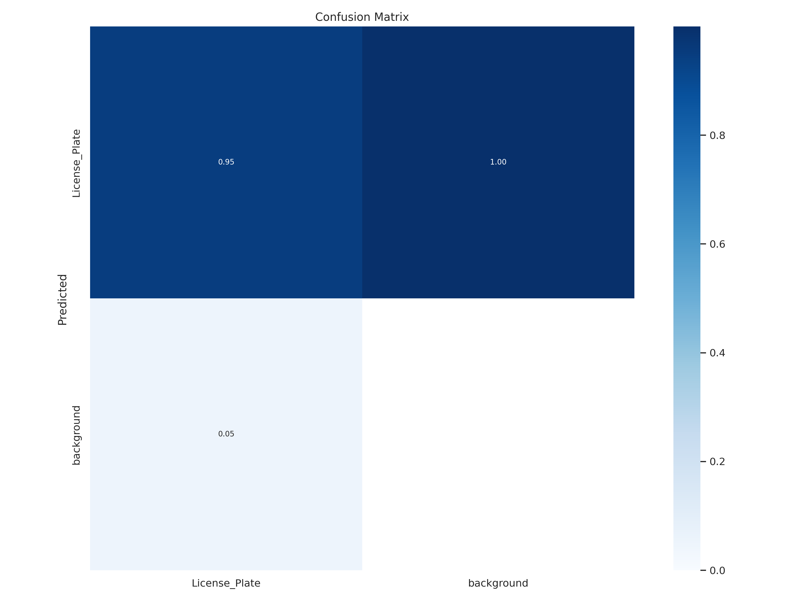
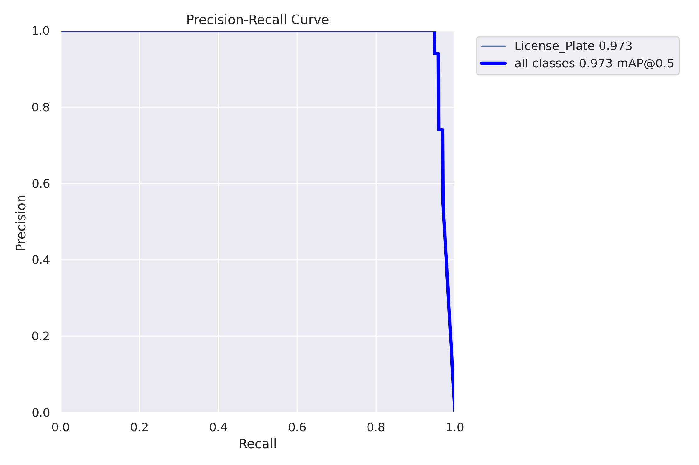

# Lebanese License Plate Recognition System

## Overview
This project implements an automated system for real-time detection and recognition of new Lebanese license plates. It integrates state-of-the-art technologies: YOLOv8 for detection and PaddleOCR for optical character recognition.


## Demo
Watch the full demo of the license plate recognition system in action here:
<video controls>
    <source src="./readme-assets/Demo_processed-ezgif.com-video-to-gif-converter.mp4" type="video/mp4">
    Your browser does not support the video tag.
</video>

## Getting Started

### Prerequisites
- Python 3.x
- OpenCV library
- Ultralytics YOLOv8
- PaddlePaddle PaddleOCR

### Installation
Clone this repository and install the required dependencies.

#### Step 1: Clone the repository
To get started, clone this repository to your local machine using the following command:

```bash
git clone https://github.com/Ghantoos7/AutoVision-Plate-Recognition.git
```

#### Step 2: Navigate to the project directory
Change into the project directory with:
```bash
cd AutoVision-Plate-Recognition
```
#### Step 3: Install the dependencies
Install all the necessary dependencies by running:
```bash
pip install -r requirements.txt
```


## Usage
To process an image or video, use the following command:

```bash
python recognize.py --source your_file_path
```

The script accepts the path to the source image or video file and processes it to output the detection and recognition results or if you put 0 it will use your camera for real time detection and recognition.

## Examples
Processed images and videos will be saved with "_processed" appended to the original file name.

### Example Images
Original Image             |  Processed Image
:-------------------------:|:-------------------------:
  |  


## Results
the model has achieved an impressive 95% accuracy in real-world conditions.

### Confusion Matrix


### Precision-Recall Curve


## Contributing
Contributions to this project are welcome! Please consider the following steps:
- Fork the project
- Create your feature branch (`git checkout -b feature/AmazingFeature`)
- Commit your changes (`git commit -m 'Add some AmazingFeature'`)
- Push to the branch (`git push origin feature/AmazingFeature`)
- Open a pull request

## License
Distributed under the MIT License. See `LICENSE` for more information.

